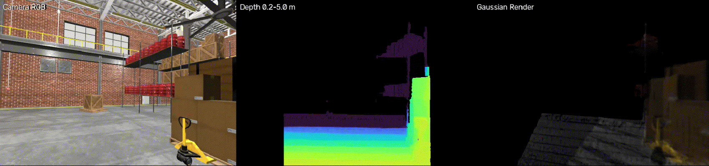

# GS-SLAM

基于 **ROS 2、双目 RGB-D 与 3D Gaussian Splatting** 的在线稠密建图系统。

项目从左右灰度图、彩色图和里程计中同步采样：ROS 前端完成双目深度估计与 RGB-D 归档，GPU 后端持续执行 Gaussian 初始化、关键帧选择、优化、稠密化和剪枝，并在结束时导出可查看的 `.ply` 地图。

## Demo

### Demo 1


### Demo 2



每个预览窗口从左到右依次显示相机 RGB、米制深度和当前视角下的 Gaussian 渲染结果。

## 特性

- ROS 2 四路近似时间同步：双目灰度图、彩色图和里程计；
- SGBM 双目匹配、左右一致性检查与深度置信度过滤；
- 前后端进程解耦，RGB-D 帧和 manifest 原子落盘，可随时离线回放；
- 在线关键帧选择、Gaussian 增长、优化、稠密化和多种可配置剪枝策略；
- 支持普通 Adam 与 CUDA `SparseGaussianAdam`；
- 支持实时 RGB/深度/渲染预览、状态监控、检查点恢复和 PLY 导出；
- 兼容项目会话格式及 Graphdeco/COLMAP 数据布局。

## 系统架构

```text
ROS 2 topics
  ├── left/right mono images
  ├── color image
  └── odometry
          │
          ▼
  gs_slam (ROS frontend)
  同步 · 双目深度 · RGB-D 归档
          │
          ▼
  session/{images,depth,manifests,sparse}
          │
          ▼
  gs_slam_backend (CUDA backend)
  Gaussian 增长 · 优化 · 稠密化 · 剪枝
          │
          ▼
  status.json · checkpoints · point_cloud_*.ply
```

前端只负责生成稳定、可重放的数据；后端不依赖 ROS，二者通过会话目录中的 manifest 协议通信。

## 环境要求

- Ubuntu 22.04 与 ROS 2 Humble；
- Python 3.10 或更高版本；
- 支持 CUDA 的 NVIDIA GPU；
- PyTorch、CUDA 版 `diff_gaussian_rasterization`、NumPy、OpenCV、SciPy、`plyfile`；
- ROS 依赖：`rclpy`、`sensor_msgs`、`nav_msgs`、`cv_bridge`、`message_filters`。

> [!IMPORTANT]
> 默认后端配置使用 `sparse_adam`，要求 `diff_gaussian_rasterization` 提供 `SparseGaussianAdam`（例如 Graphdeco `3dgs_accel` 分支）。如果当前 rasterizer 不支持，请将 [`online_backend.json`](src/gs_slam/config/online_backend.json) 中的 `optimizer_type` 改为 `adam`。

## 安装

### 1. 构建 ROS 前端

```bash
cd /path/to/GS-SLAM
source /opt/ros/humble/setup.bash
colcon build --packages-select gs_slam --symlink-install
source install/setup.bash
```

### 2. 安装 Gaussian 后端

请在已经配置好 PyTorch、CUDA rasterizer 和 Gaussian Splatting 依赖的 Python/Conda 环境中执行：

```bash
python -m pip install --no-deps -e ./src/gs_slam_backend
python -m gs_slam_backend.runner --help
```

验证 GPU 与 Sparse Adam（使用普通 Adam 时可省略第二项）：

```bash
python -c "import torch; print('CUDA:', torch.cuda.is_available())"
python -c "from diff_gaussian_rasterization import SparseGaussianAdam; print('Sparse Adam: ready')"
```

## 输入话题与标定

默认输入如下：

| Topic | 消息类型 | 用途 |
|---|---|---|
| `/camera/infra1/image_raw` | `sensor_msgs/msg/Image` | 左目灰度图 |
| `/camera/infra2/image_raw` | `sensor_msgs/msg/Image` | 右目灰度图 |
| `/camera/color/image_raw` | `sensor_msgs/msg/Image` | 彩色图 |
| `/odometry` | `nav_msgs/msg/Odometry` | 相机载体位姿 |

运行前必须按实际设备修改 [`stereo_camera.yaml`](src/gs_slam/config/stereo_camera.yaml)，尤其是话题名称、相机内参、双目基线以及相机到机体的外参。默认前端以 1 Hz 保存同步帧。

可先检查上游数据：

```bash
ros2 topic list
ros2 topic hz /camera/infra1/image_raw
ros2 topic hz /camera/infra2/image_raw
ros2 topic hz /camera/color/image_raw
ros2 topic hz /odometry
```

## 快速开始

### 在线建图

建议每次采集使用新的 session 目录，避免不同运行的帧混在一起：

```bash
cd /path/to/GS-SLAM
source /opt/ros/humble/setup.bash
source install/setup.bash

ros2 launch gs_slam online_mapping.launch.py \
  session:=$PWD/data/session_01 \
  frontend_config:=$PWD/src/gs_slam/config/stereo_camera.yaml \
  backend_config:=$PWD/src/gs_slam/config/online_backend.json \
  backend_python:=/path/to/gaussian-env/bin/python \
  backend_module_path:=$PWD/src/gs_slam_backend \
  preview:=true
```

`preview:=true` 会打开 Demo 中的三联预览窗口；按 `q` 或 `Esc` 可结束处理。无图形桌面时请使用 `preview:=false`。

### 仅采集 RGB-D

```bash
ros2 launch gs_slam frame_archiver.launch.py \
  frontend_config:=$PWD/src/gs_slam/config/stereo_camera.yaml
```

此模式不启动 GPU 后端，输出位置由 `stereo_camera.yaml` 中的 `output.directory` 决定。

### 回放已有会话

```bash
ros2 launch gs_slam replay_mapping.launch.py \
  source:=$PWD/data/session_01 \
  output:=$PWD/data/session_01/replay_output \
  backend_config:=$PWD/src/gs_slam/config/online_backend.json \
  backend_python:=/path/to/gaussian-env/bin/python \
  backend_module_path:=$PWD/src/gs_slam_backend
```

也可以绕过 ROS 直接运行后端：

```bash
python -m gs_slam_backend.runner replay \
  --source ./data/session_01 \
  --output ./data/session_01/replay_output \
  --config ./src/gs_slam/config/online_backend.json
```

添加 `--max-frames 50` 可用少量帧快速验证环境和参数。

## 输出

一次会话的典型结构如下：

```text
data/session_01/
├── images/                 # 彩色 PNG
├── depth/                  # uint16 逆深度 PNG
├── manifests/              # 逐帧 JSON 协议
├── sparse/0/               # COLMAP 兼容相机与位姿元数据
└── online_output/
    ├── status.json         # 实时状态
    ├── latest.pth          # 检查点（启用时）
    └── point_cloud_*.ply   # 最终 Gaussian 地图
```

实时查看状态：

```bash
watch -n 1 cat data/session_01/online_output/status.json
```

其中 `last_processed`、`gaussians`、`keyframes`、`coverage`、`mapping_ms` 和 `phase` 分别反映处理进度、地图规模、关键帧数量、渲染覆盖率、耗时和当前阶段。

## 正确停止

在 launch 终端按一次 `Ctrl+C`。后端会继续执行最终 refinement、清理和 PLY 原子保存；当 `status.json` 中的 `phase` 变为 `complete` 后才算完整结束。最终优化可能持续数分钟，请勿连续发送中断信号或强制结束进程。

## 配置

- [`stereo_camera.yaml`](src/gs_slam/config/stereo_camera.yaml)：话题、内外参、同步容差、采样频率、SGBM 与深度置信度；
- [`online_backend.json`](src/gs_slam/config/online_backend.json)：初始化、关键帧、损失、学习率、优化器、SH、稠密化、剪枝与最终 refinement。

后端算法参数只从 JSON 配置读取。修改源码目录中的配置后，建议在启动命令中显式传入该路径；若使用安装目录中的默认配置，则需要重新执行 `colcon build`。

## 常见问题

**没有生成 manifest**

确认四路话题均在发布、时间戳足够接近，图像能够转换为 `mono8`/`bgr8`，并检查 `stereo_camera.yaml` 中的同步容差与标定参数。

**后端提示 CUDA 不可用或找不到 rasterizer**

确认 `backend_python` 指向安装了 PyTorch 和 CUDA 扩展的环境，并在该解释器中验证 `torch.cuda.is_available()`。

**停止后没有新的 PLY**

检查 `status.json`：`final_refinement` 表示仍在最终优化；`complete` 表示保存完成，可通过 `final_ply` 字段确认输出文件。

## 项目结构

```text
GS-SLAM/
├── docs/                   # Demo 与详细文档
├── src/gs_slam/            # ROS 2 前端
├── src/gs_slam_backend/    # Gaussian GPU 后端
├── data/                   # 本地会话与地图输出
└── pyproject.toml          # 开发工具配置
```

更完整的运行参数见 [`docs/README.md`](docs/README.md)，源码职责与数据协议见 [`docs/README_CODE.md`](docs/README_CODE.md)。

## License

ROS 前端采用 [Apache License 2.0](src/gs_slam/LICENSE)。Gaussian 后端包含 Graphdeco 相关实现，使用前请阅读其 [Research-only License](src/gs_slam_backend/LICENSE.md) 与 [NOTICE](src/gs_slam_backend/NOTICE.md)。
